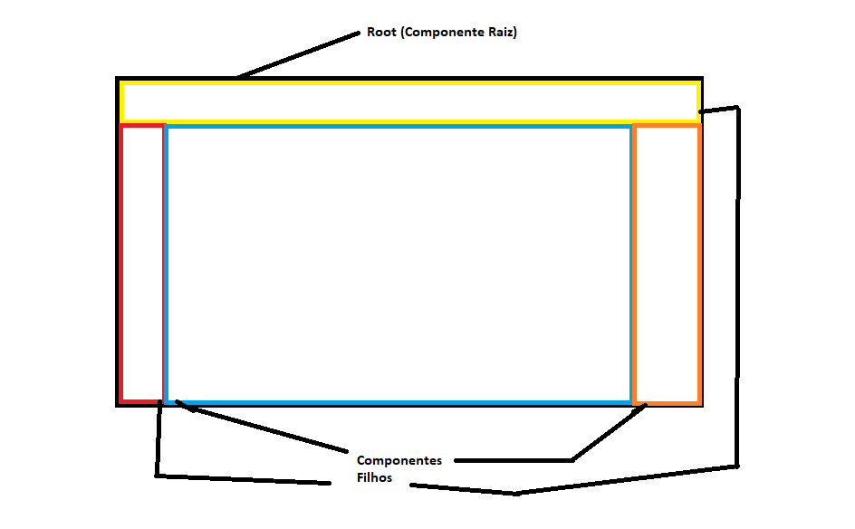
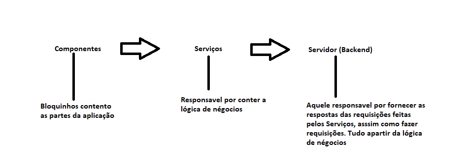

# Learn Angular

## Intro

Angular é um framework baseado em componentes, criado pela Google, mas a partir da versão 2 é mantido pela Google e Microsoft criada essa parceria para que o Angular 2 fosse escrito em TypeScript, uma espécie de sublinguagem derivada do JavaScript e criada pela Microsoft.
Focado na criação de sistema escalaveis e robustos. O Angular se encontra como um open source tento seu código no GitHub.

A partir do Angular 2 ele foi reescrito, sendo praticamente outro framework em comparação com suas versões anteriores. Para que pudesse usar os novos padrões web e fazer uso de web componentes.

Site oficial:

- https://angular.io

### Blocos Principais do Angular

#### Componentes

Encapsula:
	- Template: toda estrutura da VIEW (HTML)
	- metada: vai servir para ler e processar as classes 
	- Dado a ser mostrado na tela: Data Binding
	- Comportamento da VIEW

Sendo Orientado a Componentes: "tudo é um componente". Possuindo o seu Component Raiz (Root).

Veja um pequeno exemplo,no Diagrama abaixo todo a VIEW (Visualização, tela, ou seja o que o usuario vai ver) 
está construido em componentes como se fossem bloquinhos Lego, onde você os vai juntando até ter aquilo que se quer totalmente montada.

Assim, com sua aplicão fragmentada pelos componetes gera uma melhor manutenção deles e também em teste se torna mais víavel.

#### Serviço 
Como Componentes são as views e não se deve colocar a lógica de negocios (lógica da aplicação), dentro deles é criado 
os Serviços para que haja integração entre os Componentes e o Backend(Servidor).

E o Service tem a injeção de dependencias em outras classes.

#### Router
O Router é o respavel pelo roteamento da aplicação, ou seja, com ele é que será feito a navegação. E com o Angular 2, o conceito de SPA é mantido.

#### Diretivas
Responsavel por modificar elementos do DOM (Document Obect Model) e/ou seu comportamento. Sendo que, os Components podem também ser diretivas.
